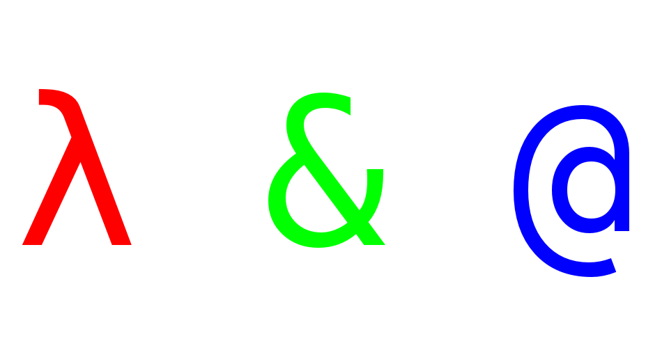
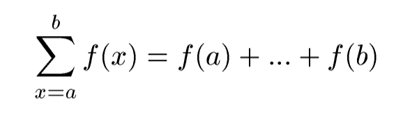
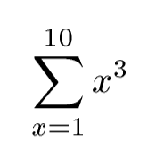
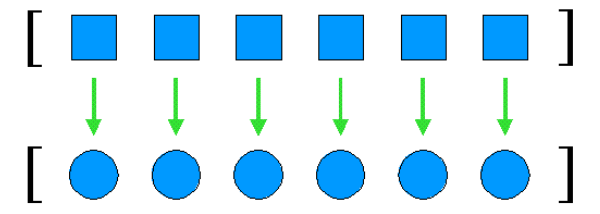
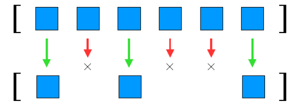
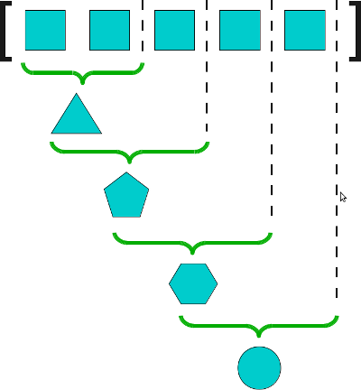

====================================
Lambdas e arrobas
====================================

* luciano@ramalho.org

-------------------------
Exemplo: calculadora RPN
-------------------------

Inspirado em exemplo de `Higher Order Perl`, by Mark J. Dominus

PDF em: http://hop.perl.plover.com/ ::

    >>> calcular('5 2 +')
    7.0
    >>> calcular('5 2 -')
    3.0
    >>> calcular('-5 2 *')
    -10.0
    >>> calcular('5 2 /')
    2.5
    >>> calcular('212 32 - 9 / 5 *')
    100.0
    >>> calcular('212 32 - 5 9 / *')
    100.0

-------------------------
RPN à moda antiga
-------------------------

::

    def calcular(expr):
        pilha = []
        for parte in expr.split():
            if numero(parte) : 
                pilha.append(float(parte))
            elif parte == '+': 
                pilha.append(pilha.pop()+pilha.pop())
            elif parte == '-': 
                pilha.append(pilha.pop(-2)-pilha.pop())
            elif parte == '*': 
                pilha.append(pilha.pop()*pilha.pop())
            elif parte == '/': 
                pilha.append(pilha.pop(-2)/pilha.pop())
            else:
                raise ValueError('operador desconhecido: %s' % parte)
        return pilha.pop()

-------------------------
RPN via *dispatch table*
-------------------------

::

    def calcular(expr):
        def empilhar(p, e):    p.append(float(e))
        def somar(p, e):       p.append(p.pop()+p.pop())
        def subtrair(p, e):    p.append(p.pop(-2)-p.pop())
        def multiplicar(p, e): p.append(p.pop()*p.pop())
        def dividir(p, e):     p.append(p.pop(-2)/p.pop())
        def erro(p, e):
            raise ValueError('operador desconhecido: %s' % e)
        acoes = {
            '<NUM>' : empilhar,
            '+' :     somar,
            '-' :     subtrair,
            '*' :     multiplicar,
            '/' :     dividir,
            '<NDA>' : erro
        }
        return processar(expr, acoes)    

----------------------
A função ``processar``
----------------------

::

    def processar(expr, acoes):
        pilha = []
        for elemento in expr.split():
            tipo = '<NUM>' if numero(elemento) else '<INDEF>'
            acao = acoes.get(tipo) or acoes.get(elemento) or acoes.get('<NDA>')
            acao(pilha, elemento)
        return pilha.pop()
        
------------------------------
Funções de primeira classe
------------------------------

- funções são cidadãos de primeira classe na linguagem
  
- uma função pode ser:

    - atribuída a uma variável

    - passada como argumento para outra função

    - devolvida como resultado de outra função

    - criada em tempo de execução

------------------------------------------
Exemplo: análise sintática para gerar AST
------------------------------------------

Função ``analisar`` devolve a AST (árvore sintática abstrata) da expressão::

    >>> analisar('5 2 +')
    ['+', '5', '2']
    >>> analisar('212 32 - 9 / 5 *')
    ['*', ['/', ['-', '212', '32'], '9'], '5']
    >>> analisar('212 32 - 5 9 / *')
    ['*', ['-', '212', '32'], ['/', '5', '9']]

---------------------------------------
AST via *dispatch table*
---------------------------------------

::

    def processar(expr, acoes):
        pilha = []
        for elemento in expr.split():
            tipo = '<NUM>' if numero(elemento) else '<INDEF>'
            acao = acoes.get(tipo) or acoes.get(elemento) or acoes.get('<NDA>')
            acao(pilha, elemento)
        return pilha.pop()
        
    def analisar(expr):
        def empilhar_atomo(p, e): p.append(e)
        def empilhar_expr(p, e): p.append([e, p.pop(-2), p.pop()])
        acoes = {
            '<NUM>' : empilhar_atomo,
            '<NDA>' : empilhar_expr,
        }
        return processar(expr, acoes)

-----------------------------
De RPN para Python e Scheme
-----------------------------

- Transforma RPN em Python::

    >>> pyexpr('5 2 +')
    '(5 + 2)'
    >>> pyexpr('212 32 - 5 9 / *')
    '((212 - 32) * (5 / 9))'

- Transforma RPN em Scheme::

    >>> sexpr('5 2 +')
    '(+ 5 2)'
    >>> sexpr('212 32 - 5 9 / *')
    '(* (- 212 32) (/ 5 9))'
    

-----------------------------
De RPN para Python
-----------------------------
    
::

    def ast2str(ast, fmt):
        if isinstance(ast, list):
            op, a1, a2 = ast
            return fmt % dict(op=op, a1=ast2str(a1, fmt), a2=ast2str(a2, fmt))
        else:
            return str(ast)

    def pyexpr(expr):
        ''' converte uma expresão RPN em uma expressão Python
        
            >>> pyexpr('212 32 - 5 9 / *')
            '((212 - 32) * (5 / 9))'
        
        '''
        ast = analisar(expr)
        return ast2str(ast, '(%(a1)s %(op)s %(a2)s)')

-----------------------------
De RPN para Scheme
-----------------------------
    
::

    def ast2str(ast, fmt):
        if isinstance(ast, list):
            op, a1, a2 = ast
            return fmt % dict(op=op, a1=ast2str(a1, fmt), a2=ast2str(a2, fmt))
        else:
            return str(ast)

    def sexpr(expr):
        ''' converte uma expresão RPN em uma s-expression 
        
            >>> sexpr('212 32 - 5 9 / *')
            '(* (- 212 32) (/ 5 9))'
        
        '''
        ast = analisar(expr)
        return ast2str(ast, '(%(op)s %(a1)s %(a2)s)')

----------------------
Funções como objetos
----------------------

- funções têm atributos

- funções podem ser criadas em tempo de execução

- funções são instâncias de `function`::

    >>> def dobro(n):
    ...    'devolve n vezes 2'
    ...    return n*2
    ... 
    >>> type(dobro)
    <type 'function'>
    >>> function
    Traceback (most recent call last):
      File "<stdin>", line 1, in <module>
    NameError: name 'function' is not defined
    >>> help(type(dobro))

----------------------
Atributos de funções
----------------------

- além de atributos comuns (como __repr__), toda função tem:

    - ``__closure__``, ``__code__``, ``__defaults__``, ``__dict__``, ``__doc__``, ``__globals__``, ``__name__``

- antigamente estes atributos eram chamados ``func_*`` (ex: ``func_code`` em vez de ``__code__``)

    - os nomes antigos ainda valem no Python 2.6 (são apelidos)

- por exemplo, o ``__doc__``::

    >>> def dobro(x):
    ...     '''devolve 2 vezes x'''
    ...     return 2*x
    ... 
    >>> dobro.__doc__
    'devolve 2 vezes x'
    >>> dobro.func_doc
    'devolve 2 vezes x'
    >>> 

- no mini-curso podemos falar sobre os demais (amanhã, 15h)

------------------------
Atributos de funções
------------------------

- funções também podem receber atributos arbitrários::

    >>> def mult(x):
    ...     return mult.fator * x
    ... 
    >>> mult.fator = 5
    >>> mult(3)
    15

- no Django este tipo de atributo é usado como anotação

-----------------------------------
Criar funções em tempo de execução
-----------------------------------

- ``lambda``: quando o corpo da função é apenas uma expressão::

    >>> def dobro(n):
    ...     return n*2
    ... 
    >>> dobro
    <function dobro at 0xb7ea17d4>
    >>> type(dobro)
    <type 'function'>
    
    >>> d = lambda n: n*2
    >>> d
    <function <lambda> at 0xb7d2287c>
    >>> type(d)
    <type 'function'>
    >>> d(3)
    6

- outras formas de criar funções no mini-curso, sábado, 15h

-------------------------------------
RPN via *dispatch table* com lambdas
-------------------------------------

::

    def calcular(expr):
        def erro(p, e):
            raise ValueError('operador desconhecido: %s' % e)

        acoes = {
            '<NUM>' : lambda p,e: p.append(float(e)),
            '+' : lambda p,e: p.append(p.pop()+p.pop()),
            '-' : lambda p,e: p.append(p.pop(-2)-p.pop()),
            '*' : lambda p,e: p.append(p.pop()*p.pop()),
            '/' : lambda p,e: p.append(p.pop(-2)/p.pop()),
            '<NDA>' : erro
        }
        return processar(expr, acoes)    

------------------------
Limitações do lambda
------------------------

- A sintaxe não suporta comandos (statements), mas apenas expressões::

    def calcular(expr): 

        def erro(p, e): # <- não pode ser um lambda
            raise ValueError('operador desconhecido: %s' % e)

        acoes = {
            '<NUM>' : lambda p,e: p.append(float(e)),
            '+' : lambda p,e: p.append(p.pop()+p.pop()),
            '-' : lambda p,e: p.append(p.pop(-2)-p.pop()),
            '*' : lambda p,e: p.append(p.pop()*p.pop()),
            '/' : lambda p,e: p.append(p.pop(-2)/p.pop()),
            '<NDA>' : erro
        }
        return processar(expr, acoes)    

- São necessários cuidados especiais para usar lambdas como closures.

------------------------
Closures
------------------------

O que é
    uma *closure* é um um objeto invocável que armazena uma definição de função junto com um ambiente (*environment*) que contém as variáveis livres existentes no escopo da definição

Resultado
    quando a função é invocada posteriormente ela pode acessar as variáveis que existiam no escopo da definição, mesmo que a invocação ocorra fora daquele escopo

Como???
    isso daria uma palestra inteira... vou mostrar como funciona no mini-curso, amanhã, 15h.

------------------------------
Método para refatorar lambdas
------------------------------

Fredrik Lundh, citado no *Functional Programming HOWTO*, de A. M. Kuchling (http://docs.python.org/dev/howto/functional.html)

   1. Escreva uma função ``lambda``.
   2. Escreva um comentário explicando o que a função lambda faz.
   3. Estude o comentário atentamentem, e pense em um nome que capture a essência do comentário.
   4. Crie uma função usando o comando ``def``, usando este nome
   5. Remova o ``lambda`` e o comentário.

--------------------------------
Somatória: exemplo de abstração
--------------------------------

Em matemática:

Em Scheme:

.. code-block:: scheme

    (define (sum term a next b)
      (if (> a b)
          0
          (+ (term a)
             (sum term (next a) next b))))

---------------------------
Somatória à moda do Scheme
---------------------------

::

    def somatoria(termo, a, proximo, b):
        if a > b: return 0
        return termo(a) + somatoria(termo, proximo(a), proximo, b)
        
    def soma_cubos(a, b):
        return somatoria(lambda x:x**3, a, lambda x:x+1, b)

.. admonition:: Cuidado

    Uso altamente ineficiente de recursão!

----------------------------
Somatória iterativa
----------------------------

::

    def somatoria(termo, a, proximo, b):
        total = 0
        while a <= b:
            total += termo(a)
            a = proximo(a)
        return total

    def cubo(n): 
        return n**3

    def inc(n): 
        return n + 1

    def soma_cubos(a, b):
        return somatoria(cubo, a, inc, b)

----------------------------
Somatória à moda de Python
----------------------------

::

    def somatoria(termo, a, proximo, b):
        def serie(a):
            while a <= b:
                yield termo(a)
                a = proximo(a)
        return sum(serie(a))

    def cubo(n): 
        return n**3

    def inc(n): 
        return n + 1

    def soma_cubos(a, b):
        return somatoria(cubo, a, inc, b)

Ou ainda::

    sum(n**3 for n in xrange(a, b))

------------------------
A caminho de π
------------------------

::

    from math import pi

    def soma_pi(a, b):
        def termo_pi(x):
            return 1.0 / (x * (x + 2))
        def prox_pi(x):
            return x + 4
        return somatoria(termo_pi, a, prox_pi, b) * 8
        
    if somatoria is soma_rec:
        # se b > 3988: RuntimeError: maximum recursion depth exceeded
        assert abs(pi - soma_pi(1, 3988)) < 0.001 
    else:
        assert abs(pi - soma_pi(1, 1000000)) < 0.00001

Ou ainda::

    quase_pi = sum(1.0 / (x * (x + 2)) for n in xrange(1, 1000000, 4)) * 8

--------------------------
Funções de ordem superior
--------------------------

- Funções que aceitam funções como argumentos::

    def somatoria(termo, a, proximo, b):
        def serie(a):
            while a <= b:
                yield termo(a)
                a = proximo(a)
        return sum(serie(a))

------------------------------------
Funções de ordem superior
------------------------------------

- Exemplos na biblioteca padrão de Python:

    - ``map(function, iterable, ...)``
    
    - ``filter(function, iterable)``

    - ``reduce(function, iterable[, initializer])``

    - ``sorted(iterable[, cmp[, key[, reverse]]])``

    - ``max(iterable[, args...][, key])``

    - ``min(iterable[, args...][, key])``

---------------------------------
``map``: uma abstração muito útil
---------------------------------

Produzir uma lista a partir da outra, aplicando uma operação para gerar cada itens::

    >>> l = [11, 22, 33, 44, 55, 66]

    >>> map(lambda x: x/2.0, l)
    [5.5, 11.0, 16.5, 22.0, 27.5, 33.0]

---------------------------------------
``filter``: outra abstração muito útil
---------------------------------------

Produzir uma lista a partir da outra, preservando apenas itens que satisfazem uma condição::

    >>> l = [11, 22, 33, 44, 55, 66]
    >>> filter(lambda x: not x%2, l)
    [22, 44, 66]

-----------------------------------------
``map`` e ``filter`` X listcomp e genexp
-----------------------------------------

- *listcomps* (compreensões de listas) e *genexps* (expressões geradoras) são mais fáceis de ler::

    >>> l = [11, 22, 33, 44, 55, 66]

    >>> map(lambda x: x/2.0, l)
    [5.5, 11.0, 16.5, 22.0, 27.5, 33.0]
    >>> [x/2.0 for x in l]
    [5.5, 11.0, 16.5, 22.0, 27.5, 33.0]

    >>> filter(lambda x: not x%2, l)
    [22, 44, 66]
    >>> [x for x in l if not x%2]
    [22, 44, 66]

    >>> map(lambda x: x/2.0, filter(lambda x: not x%2, l))
    [11.0, 22.0, 33.0]
    >>> [x/2.0 for x in l if not x%2]
    [11.0, 22.0, 33.0]

----------------------------------------------
``reduce``: resumir uma sequencia em um valor
----------------------------------------------

- conhecida como ``foldl`` em Haskell (tem também a ``foldr``)

-------------------------------------------
De ``reduce`` a ``sum``, ``all``, ``any``
-------------------------------------------

- ``sum(iterable)`` era feito assim::

    reduce(lambda a,b:a+b, iterable)

- para calcular séries de multiplicações, ainda é útil::

    >>> from operator import mul
    >>> reduce(mul, xrange(1,6))
    120
    >>> reduce(mul, xrange(1,43))
    1405006117752879898543142606244511569936384000000000L
    >>> 

-------------------------------------------
De ``reduce`` a ``sum``, ``all``, ``any``
-------------------------------------------

- em Python 3, ``reduce`` foi movida para o módulo ``functools``

- os usos mais comuns de ``reduce`` viraram built-ins a partir do Python 2.5

    - ``sum(iterable)``
    
    - ``all(iterable)``
    
    - ``any(iterable)``

-----------------------
Funções como resultados
-----------------------

- mais funções de ordem superior na biblioteca padrão:

    - sorted(iterable[, cmp[, key[, reverse]]])

    - max(iterable[, args...][, key])

    - min(iterable[, args...][, key])

- itemgetter (modulo operator)::

    def itemgetter(*items):
        if len(items) == 1:
            item = items[0]
            def g(obj):
                return obj[item]
        else:
            def g(obj):
                return tuple(obj[item] for item in items)
        return g

- attrgetter

----------------------
Decoradores: origem
----------------------

Motivação inicial: métodos de classe e métodos estáticos::

    '''
        >>> Coisa.faz()
        Faz algo com a classe <Coisa>
        >>> Coisa.bla()
        Eu poderia ser uma função global

    '''
    class Coisa(object):
        def faz(cls):
            print 'Faz algo com a classe <%s>' % cls.__name__
        faz = classmethod(faz)

        def bla():
            print 'Eu poderia ser uma função global'
        bla = staticmethod(bla)

----------------------------------
Decoradores: sintaxe de aplicação
----------------------------------

Motivação inicial: métodos de classe e métodos estáticos::

    '''
        >>> Coisa.faz()
        Faz algo com a classe <Coisa>
        >>> Coisa.bla()
        Eu poderia ser uma função global

    '''
    class Coisa(object):
        def faz(cls):
            print 'Faz algo com a classe <%s>' % cls.__name__
        faz = classmethod(faz)

        def bla():
            print 'Eu poderia ser uma função global'
        bla = staticmethod(bla)

----------------------------------
Decoradores: sintaxe de aplicação
----------------------------------

Sintaxe mais limpa para métodos de classe e métodos estáticos::

    '''
        >>> Coisa.faz()
        Faz algo com a classe <Coisa>
        >>> Coisa.bla()
        Eu poderia ser uma função global

    '''
    class Coisa(object):
        @classmethod
        def faz(cls):
            print 'Faz algo com a classe <%s>' % cls.__name__

        @staticmethod
        def bla():
            print 'Eu poderia ser uma função global'

-----------------------------
Esqueleto de um decorador
-----------------------------

- Todo decorador é uma função de ordem superior: aceita uma função como argumento e devolve outra função.

- No caso mais comum, a função devolvida usa a função que foi passada como argumento::

    def meu_decorador(funcao):
        def _decorada(*args, **kw):
            # fazer algo antes de invocar a função
            resultado = funcao(*args, **kw)
            # fazer algo depois de invocar a função
            return res
        # devolver a funcao decorada
        return _decorada

------------------------------
Exemplos de uso
------------------------------

- Memoização: ``cache`` de resultados para evitar recálculo e acessos remotos

- Verificação de argumentos: checagem de tipos, depuração

- *Proxy*: por exemplo, controle de acesso às views no Django

- Cadê o código? venha para o mini-curso amanhã às 15h00

---------------------------------
Em teoria programação funcional é
---------------------------------  

Wikipedia
  
    [...] functional programming is a programming paradigm that treats computation as the evaluation of mathematical functions and avoids state and mutable data. It emphasizes the application of functions, in contrast to the imperative programming style, which emphasizes changes in state. (http://en.wikipedia.org/wiki/Functional_programming)
    
Michael L. Scott, *Programming Language Pragmatics*    

    In a strinct sense of the term, functional programming defines the outputs of a program as a mathematical function of the inputs, with no notion of internal state, and thus no side effects.
	
-------------------------------------
Linguagens funcionais oferecem
-------------------------------------

Michael L. Scott, `Programming Language Pragmatics` (p. 508)

- funções como objetos de primeira classe e funções de ordem superior

- polimorfismo extensivo

- estruturas de dados tipo listas e operadores para listas

- expressões e funções capazes de construir objetos estruturados

- coleta de lixo automática

----------------------------------
Python é uma linguagem funcional?
----------------------------------

    Programming language ‘‘paradigms’’ are a moribund and tedious legacy of a bygone age. Modern language designers pay them no respect, so why do our courses slavishly adhere to them? (Shriram Krishnamurthi, author of `Programming Languages: Application and Interpretation`)

- Python é "multi-paradigma"

- Características imperativas, OO e funcionais

    Practicality beats purity (Tim Peters, `The Zen of Python`)
    

-------------------------------------
Novas formas de colar componentes
-------------------------------------

John Hughes, `Why Functional Programming Matters`
 
        Languages which aim to improve productivity must support modular programming well. But new scope rules and mechanisms for separate compilation are not enough - modularity means more than modules. Our ability to decompose a problem into parts depends directly on our ability to glue solutions together. To assist modular programming, a language must provide good glue. Functional programming languages provide two new kinds of glue - higher-order functions and lazy evaluation. 

----------------
Referências
----------------

- Functional Programming HOWTO, A. M. Kuchling

- Paper:

    - Hughes, John - `Why Functional Programming Matters` in “Research Topics in Functional Programming” ed. D. Turner, Addison-Wesley, 1990, pp 17–42.

- Livros

    - Python in a Nutshell, Alex Martelli

    - Expert Python Programming, Tarek Ziadé

    - SICP: Structure and Interpretation of Computer Programs

----------------
Perguntas?
----------------

Luciano Ramalho <luciano@ramalho.org>

